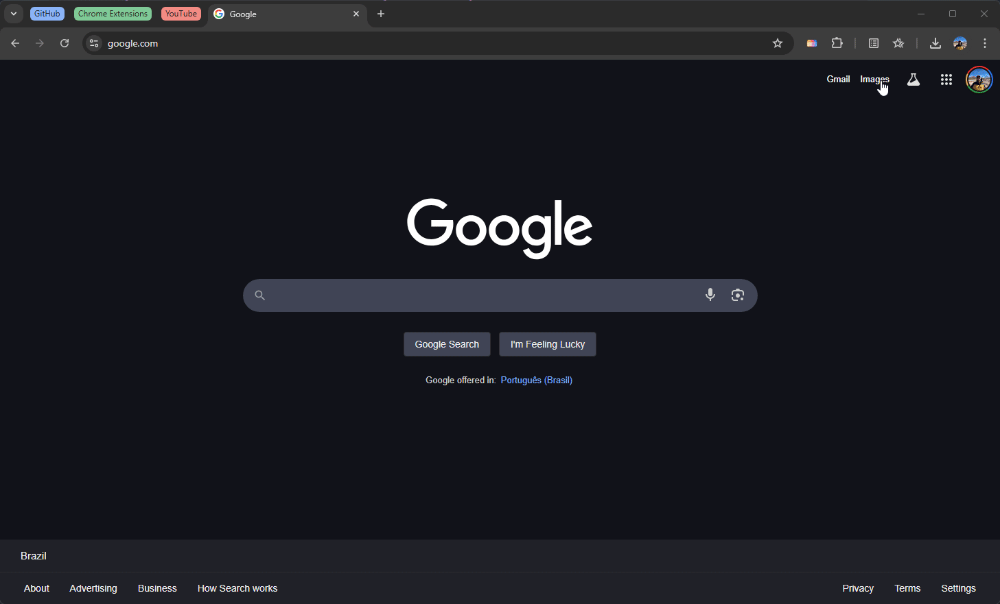
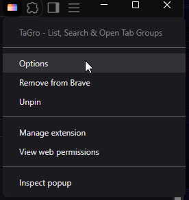

  

# TaGro

TaGro is a Chromium extension to list, search and open Tab Groups by using shortcuts.

  

# Requirements

- Chrome/Chromium/Brave (or any other Chromium-based browser)
- Tab Groups enabled (it is by default)
- Tab Groups opened (if you want to see them in the list)

# Installation

To install TaGro, you can either:
- Download the extension from the [Chrome Web Store](https://chrome.google.com/webstore/detail/tagro/).
- Download the source code and load it as an unpacked extension:
  - Go to the extension management page
  - Enable "Developer mode" (usually at the top right corner)
  - Click on "Load unpacked"
  - Select the folder where you downloaded the source code
  - The extension should now be loaded and you should see it in the list of extensions
- After that, you can:
  - Pin it to the toolbar by clicking on the puzzle icon (top right corner) and clicking on the pin icon next to TaGro
  - Right-click on the extension icon and select "Pin" to pin it to the toolbar, or
  - Right-click on the extension icon and select "Manage extension" to open the extension's settings page

# Usage

TaGro comes with a single default shortcut defined, that can be changed.

## Default shortcut
The default shortcut to open it is: `Ctrl/Cmd + Shift + Y`.

> I personally use Ctrl/Cmd + G, but setting this as default would overwrite a default shortcut to find the next occurence when you do a Find (`Ctrl/Cmd + F`).

When you open it, it will list your Tab Groups.

You can also:
- Navigate between the Tab Groups by using your up (↑) and down (↓) arrow keys
- Press enter/return with a Tab Group highlighted to open it
- Click on a Tab Group to open it

## First use

**Chrome/Chromium does not provide an API to fetch saved Tab Groups that aren't opened.**

Which means that you won't see any saved Tab Groups that are closed when you first open TaGro.

To see them, you need to open them first and keep them opened. Unless you already have them opened, then you're good to go.

## Settings

You can set custom background colors for light and dark mode.

This can be done through TaGro's settings, that you can open by right-clicking the extension's icon:

Or by clicking "Manage extension" and clicking on "Extension options".

The TaGro Settings page will open and you will be able to set the custom colors (be careful dark mode users, it's a white page).

# Contributing

You are welcome to contribute to this extension. The code is pretty simple.

The extension is here to stay (or at least until Chrome/Chromium/Brave adds a shortcut to open the Tab Groups).